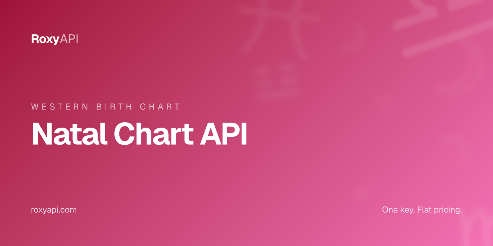

[](https://roxyapi.com/products/astrology-api)

# Natal Chart API

> Western natal chart with all 10 planetary positions, 12 house cusps across 4 house systems, major and minor aspects, Ascendant, Midheaven, dominant elements and modalities. One key covers 10 spiritual domains. MCP-first, verified against NASA JPL Horizons.

[](https://roxyapi.com/pricing)
[](https://roxyapi.com/api-reference)
[](https://roxyapi.com/methodology)
[](https://roxyapi.com/docs/mcp)
[](https://roxyapi.com/docs/sdk)

## What is Natal Chart API

A natal chart (birth chart) is the snapshot of the sky at the moment of birth. This repo ships working TypeScript, JavaScript, and Python samples against the RoxyAPI natal chart endpoint. The response returns a complete Western astrology natal chart with tropical zodiac. All 10 planetary positions (Sun through Pluto), 12 house cusps with customizable house systems (Placidus, Whole Sign, Equal, Koch), major and minor aspects, Ascendant, Midheaven, and dominant elements and modalities. One subscription unlocks 10 spiritual domains: Western astrology, Vedic astrology, numerology, tarot, biorhythm, I Ching, crystals, dreams, and angel numbers. Every planetary position is computed by Roxy Ephemeris, verified against NASA JPL Horizons.

## Why this API

| Property | Value |
|----------|-------|
| Coverage | 10 spiritual domains in one subscription |
| Calculation | Roxy Ephemeris, verified against NASA JPL Horizons |
| MCP server | `https://roxyapi.com/mcp/astrology` (Streamable HTTP, no local setup) |
| SDKs | TypeScript on npm `@roxyapi/sdk`, Python on PyPI `roxy-sdk` |
| Pricing | One key, flat per call, $39 for 25K calls |
| Licensing | No AGPL or GPL entanglement |
| Last verified | 2026-Q2 |

## Quick start

1. Get a key at [roxyapi.com/pricing](https://roxyapi.com/pricing)
2. Pick a language below
3. Copy the snippet, run, ship

### cURL

```bash
# Step 1: geocode the birth city
curl -s "https://roxyapi.com/api/v2/location/search?q=New+York" \
  -H "X-API-Key: $ROXY_API_KEY"

# Step 2: call the natal chart endpoint with latitude, longitude, and timezone from cities[0]
curl -X POST https://roxyapi.com/api/v2/astrology/natal-chart \
  -H "X-API-Key: $ROXY_API_KEY" \
  -H "Content-Type: application/json" \
  -d '{
    "date": "1990-07-15",
    "time": "14:30:00",
    "latitude": 40.7128,
    "longitude": -74.006,
    "timezone": "America/New_York",
    "houseSystem": "placidus"
  }'
```

### Python

```python
import os
from roxy_sdk import create_roxy

roxy = create_roxy(os.environ["ROXY_API_KEY"])

# Step 1: geocode the birth city. Never hardcode coordinates.
loc = roxy.location.search_cities(q="New York")
city = loc["cities"][0]

# Step 2: generate the full natal chart
result = roxy.astrology.generate_natal_chart(
    date="1990-07-15",
    time="14:30:00",
    latitude=city["latitude"],
    longitude=city["longitude"],
    timezone=city["timezone"],
    house_system="placidus",
)

print("Ascendant:", result["ascendant"]["sign"], result["ascendant"]["degree"])
print("Midheaven:", result["midheaven"]["sign"])
for planet in result["planets"][:3]:
    print(planet["name"], "in", planet["sign"], "house", planet["house"])
```

### JavaScript (Node)

```js
import { createRoxy } from '@roxyapi/sdk';

const roxy = createRoxy(process.env.ROXY_API_KEY);

// Step 1: geocode the birth city. Never hardcode coordinates.
const { data: loc } = await roxy.location.searchCities({ query: { q: 'New York' } });
const { latitude, longitude, timezone } = loc.cities[0];

// Step 2: generate the full natal chart
const { data, error } = await roxy.astrology.generateNatalChart({
  body: {
    date: '1990-07-15',
    time: '14:30:00',
    latitude,
    longitude,
    timezone,
    houseSystem: 'placidus',
  },
});

if (error) throw new Error(error.error);

console.log('Ascendant:', data.ascendant.sign, data.ascendant.degree);
console.log('Midheaven:', data.midheaven.sign);
data.planets.slice(0, 3).forEach(p =>
  console.log(`${p.name} in ${p.sign} house ${p.house}`)
);
```

### TypeScript

```ts
import { createRoxy } from '@roxyapi/sdk';

const roxy = createRoxy(process.env.ROXY_API_KEY!);

// Step 1: geocode the birth city. Never hardcode coordinates.
const { data: loc } = await roxy.location.searchCities({ query: { q: 'New York' } });
const { latitude, longitude, timezone } = loc.cities[0];

// Step 2: generate the full natal chart with planets, houses, aspects, Ascendant, Midheaven
const { data, error } = await roxy.astrology.generateNatalChart({
  body: {
    date: '1990-07-15',
    time: '14:30:00',
    latitude,
    longitude,
    timezone,
    houseSystem: 'placidus',
  },
});

if (error) throw new Error(error.error);

console.log('Ascendant:', data.ascendant.sign, data.ascendant.degree);
console.log('Midheaven:', data.midheaven.sign);
console.log('Dominant element:', data.summary.dominantElement);
console.log('Dominant modality:', data.summary.dominantModality);
data.planets.slice(0, 3).forEach(p =>
  console.log(`${p.name} in ${p.sign} (house ${p.house}) ${p.isRetrograde ? 'retrograde' : ''}`)
);
console.log('Total aspects:', data.aspects.length);
console.log('Pattern:', data.aspectsInterpretation.summary);
```

## Request schema

| Field | Type | Required | Description |
|-------|------|----------|-------------|
| `date` | string | yes | Birth date in YYYY-MM-DD format. Determines planetary positions for the specific calendar day |
| `time` | string | yes | Birth time in 24-hour HH:MM:SS format. Determines the Ascendant (rising sign) and house cusps. Use 12:00:00 if unknown |
| `latitude` | number | yes | Birth location latitude in decimal degrees (-90 to 90). Positive = North, negative = South. Call `/location/search` to get this |
| `longitude` | number | yes | Birth location longitude in decimal degrees (-180 to 180). Positive = East, negative = West. Call `/location/search` to get this |
| `timezone` | number or string | yes | Decimal hours from UTC (e.g. -5 for EST, 5.5 for IST) OR IANA name (e.g. "America/New_York", "Asia/Kolkata"). IANA strings resolve to the DST-correct offset for the given date, so you can pass `cities[0].timezone` from `/location/search` directly |
| `houseSystem` | string | no | `placidus` (default), `whole-sign`, `equal`, or `koch`. Placidus is most popular in Western astrology and time-sensitive. Whole Sign assigns one sign per house. Equal divides the chart into 30 degree segments from the Ascendant. Koch emphasizes houses in high latitudes |

## Response shape

```json
{
  "birthDetails": {
    "date": "1990-07-15",
    "time": "14:30:00",
    "latitude": 40.7128,
    "longitude": -74.006,
    "timezone": -4
  },
  "planets": [
    {
      "name": "Sun",
      "longitude": 113.01,
      "latitude": 0.0,
      "sign": "Cancer",
      "degree": 23.01,
      "house": 9,
      "speed": 0.9541,
      "isRetrograde": false,
      "interpretation": {
        "summary": "Your Sun in Cancer in The Ninth House reveals how you express self-awareness and ego in the realm of beliefs.",
        "detailed": "Sun represents self-awareness and ego. In Cancer, this energy becomes intuitive, nurturing, protective...",
        "keywords": ["intuitive", "emotional", "intelligent", "passionate"]
      }
    }
  ],
  "houses": [
    { "number": 1, "longitude": 216.94, "sign": "Scorpio", "degree": 6.94 }
  ],
  "houseSystem": "placidus",
  "aspects": [
    {
      "planet1": "Sun",
      "planet2": "Moon",
      "type": "TRINE",
      "angle": 120,
      "orb": 2.5,
      "isApplying": true,
      "strength": 75,
      "interpretation": "harmonious"
    }
  ],
  "aspectsInterpretation": {
    "summary": "Your chart contains 33 aspects: 5 harmonious, 16 challenging, and 12 neutral.",
    "dominant": "balanced",
    "harmonious": 5,
    "challenging": 16,
    "neutral": 12
  },
  "ascendant": { "sign": "Scorpio", "degree": 6.94, "longitude": 216.94 },
  "midheaven": { "sign": "Leo", "degree": 14.37, "longitude": 134.37 },
  "summary": {
    "dominantElement": "Earth",
    "dominantModality": "Cardinal",
    "retrogradePlanets": ["Saturn", "Uranus", "Neptune", "Pluto"],
    "elementDistribution": { "Fire": 3, "Earth": 4, "Air": 2, "Water": 4 },
    "modalityDistribution": { "Cardinal": 7, "Fixed": 5, "Mutable": 1 }
  }
}
```

| Field | Type | Description |
|-------|------|-------------|
| `birthDetails` | object | Birth details echoed back from the request. Confirms the input used for this chart |
| `planets` | array | All 10 planetary positions with zodiac signs, house placements, and interpretations. Includes North Node, South Node, and Chiron |
| `planets[].sign` | string | Tropical zodiac sign this planet occupies |
| `planets[].house` | number | House placement (1-12) based on the selected house system |
| `planets[].speed` | number | Daily motion in degrees per day. Negative values indicate retrograde |
| `planets[].isRetrograde` | boolean | Whether the planet is in retrograde motion |
| `planets[].interpretation` | object | Planet-in-sign-in-house narrative analysis with `summary`, `detailed`, and `keywords` |
| `houses` | array | All 12 house cusps with zodiac positions. House cusps divide the chart into life areas |
| `houseSystem` | string | House system used for this chart (`placidus`, `whole-sign`, `equal`, or `koch`) |
| `aspects` | array | All planetary aspects found in this chart with orbs, strength, and interpretation |
| `aspects[].type` | string | Aspect type: CONJUNCTION, OPPOSITION, TRINE, SQUARE, SEXTILE, and minor aspects |
| `aspects[].orb` | number | Distance from exact aspect in degrees. Tighter orb means stronger influence |
| `aspects[].strength` | number | Aspect strength percentage (0-100) based on orb tightness |
| `aspects[].isApplying` | boolean | Whether the aspect is applying (growing stronger) or separating (fading) |
| `aspectsInterpretation` | object | Aspect pattern analysis: count of harmonious, challenging, neutral plus narrative `summary` and `dominant` flag |
| `ascendant` | object | Rising sign at the eastern horizon. Defines outward personality and physical appearance |
| `midheaven` | object | MC. The highest point of the ecliptic at birth, representing career direction and public image |
| `summary` | object | Chart summary with `dominantElement`, `dominantModality`, `retrogradePlanets`, `elementDistribution`, `modalityDistribution` |

## Common use cases

| Use case | Endpoint flow |
|----------|---------------|
| Birth chart generator on an astrology website | Call `/location/search`, then POST to `/astrology/natal-chart`. Render the chart wheel from `planets[]` and `houses[]` |
| Co-Star style natal chart product | Use `planets[].interpretation.summary` for the personality blurb per planet placement |
| Astrology app rising sign and big three display | Read `ascendant.sign` plus the `Sun` and `Moon` entries in `planets[]` |
| Astrological consultation tool with full report | Combine `planets[].interpretation.detailed` plus `aspectsInterpretation.summary` for a long-form report |
| Aspect grid table (classic chart UI) | Pivot `aspects[]` by `planet1` and `planet2` for a grid view, sorted by `strength` descending |
| Chart wheel SVG renderer | Use `houses[].longitude` and `planets[].longitude` to plot positions on a 360 degree wheel |

## Related endpoints in this domain

- `POST /astrology/synastry` (`calculateSynastry`) - inter-aspect analysis between two natal charts plus a compatibility score
- `POST /astrology/transits` (`calculateTransits`) - current sky transits to a natal chart for live timing overlays
- `GET /astrology/horoscope/{sign}/daily` (`getDailyHoroscope`) - daily horoscope by zodiac sign with overview, love, career, health

## Use this in your AI agent

Connect Claude, GPT, Gemini, or Cursor to RoxyAPI through the remote MCP server. No Docker. No self hosting. The full MCP tool catalog for this domain is at `https://roxyapi.com/mcp/astrology`.

```json
{
  "mcpServers": {
    "astrology": {
      "url": "https://roxyapi.com/mcp/astrology",
      "headers": { "X-API-Key": "$ROXY_API_KEY" }
    }
  }
}
```

See [docs/mcp](https://roxyapi.com/docs/mcp) for Claude Desktop, Cursor, Windsurf, VS Code, and Claude Code setup.

## For AI coding agents

This repo ships an [AGENTS.md](AGENTS.md) execution playbook. Cursor, Claude Code, Aider, Codex, Windsurf, RooCode, and Gemini CLI will pick it up automatically. Top level overview lives at [roxyapi.com/AGENTS.md](https://roxyapi.com/AGENTS.md).

## Resources

- [Methodology and gold standard tests](https://roxyapi.com/methodology) verified against NASA JPL Horizons
- [Full API reference](https://roxyapi.com/api-reference) interactive Scalar UI
- [TypeScript SDK on npm](https://www.npmjs.com/package/@roxyapi/sdk)
- [Python SDK on PyPI](https://pypi.org/project/roxy-sdk/)
- [llms.txt](https://roxyapi.com/llms.txt) full LLM citation index
- [Top level AGENTS.md](https://roxyapi.com/AGENTS.md)

## Other RoxyAPI samples

[](https://github.com/RoxyAPI/kp-astrology-api)
[](https://github.com/RoxyAPI/synastry-api)
[](https://github.com/RoxyAPI/daily-horoscope-api)
[](https://github.com/RoxyAPI/kundli-api)
[](https://github.com/RoxyAPI/numerology-api)

## License

MIT for this sample repo. See [LICENSE](LICENSE).

**Catalog licensing:** Personal and Commercial Use. No AGPL or GPL entanglement. Full posture at [roxyapi.com/policy/license](https://roxyapi.com/policy/license).

## Contact

- Site: [roxyapi.com](https://roxyapi.com)
- Status: [roxyapi.com/api-reference](https://roxyapi.com/api-reference)
